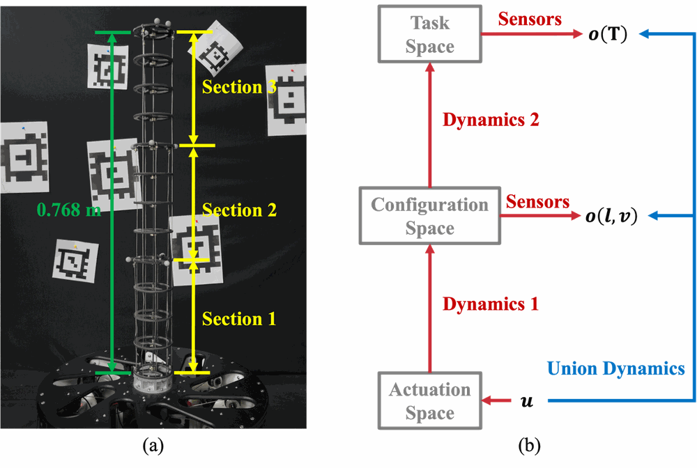
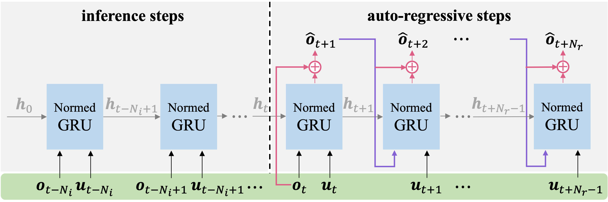
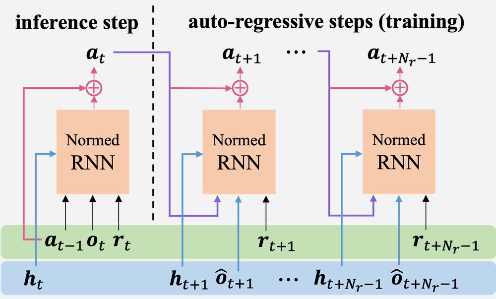

# ContinuumControl

Official implementation of:

- **Learning-Based Dynamics Modeling and Robust Control for Tendon-Driven Continuum Robots** (Ziqing Zou*, Ke Qiu*, Fei Wang, Haojian Lu, Rong Xiong, Yue Wang) — [arXiv:2604.25691](https://arxiv.org/abs/2604.25691)
- **Reference-Augmented Learning for Precise Tracking Policy of Tendon-Driven Continuum Robots** (Ziqing Zou, Ke Qiu, Haojian Lu, Rong Xiong, Yue Wang) — [arXiv:2604.25698](https://arxiv.org/abs/2604.25698)

## Overview

ContinuumControl is a differentiable learning framework for tendon-driven continuum robots (TDCRs) that integrates high-fidelity dynamics modeling with robust neural control.

📄 **Paper**: [arXiv:2604.25691](https://arxiv.org/abs/2604.25691) | 🎬 **Video**: [Bilibili](https://www.bilibili.com/video/BV182jR67Ek5/)

<p align="center">
  
</p>

TDCRs pose significant modeling and control challenges due to complex nonlinearities such as frictional hysteresis and transmission compliance. Our framework addresses these through two core components:

- **Dynamics Model**: A GRU-based recurrent model with **bidirectional multi-channel connectivity** and **residual prediction** that effectively suppresses compounding errors during long-horizon auto-regressive prediction.
- **Control Policy**: An end-to-end neural policy optimized by **backpropagating tracking errors through the differentiable dynamics model**, which implicitly internalizes compensation for intricate nonlinearities.

## Method

### Dynamics Model

The dynamics model recurrently predicts the next observation given the current observation and control input, formulated as:

```
h_{t+1} = f_θ(h_t, o_t, u_t)
Δô_t   = g_ψ(h_{t+1})
ô_{t+1} = o_t + Δô_t
```

where `o = (l, v, p, φ)` concatenates motor lengths, velocities, and end-effector position and rotation vector. The residual formulation captures the underlying physical continuity and significantly suppresses error accumulation.

The training pipeline consists of two phases:
1. **Inference phase**: Ground-truth observations and controls are sequentially fed into the GRU to warm up the hidden state `h`.
2. **Auto-regressive phase**: The model performs multi-step rollouts where both the hidden states and predicted observations are fed back, with prediction loss backpropagated through time.

<p align="center">
  
</p>

### Neural Control Policy

Traditional Jacobian-based controllers treat the TDCR as a quasi-static system (`u = J†(ṙ + Ke)`), which fails under hysteresis and compliance. Our policy leverages the hidden state `h` from the dynamics model as latent temporal context, transforming the non-Markovian physical process into a well-conditioned tracking task:

```
Δa_t = π_μ(o_t, h_t, a_{t-1}, r_t)
```

where `r_t` is a look-ahead reference of `N_r` future steps. The policy is optimized by minimizing a tracking cost through BPTT:

```
min_μ J(μ) = E[ Σ λ^{i-1} ( ||T̂_{t+i} - T*_{t+i}||² + α||Δa_{t+i-1}||² ) ]
```

<p align="center">
  
</p>

### Reference Augmentation

To prevent overfitting to specific trajectories in the offline dataset, a **multi-scale reference augmentation** scheme is applied during policy training. The augmented reference is generated by superimposing three stochastic components onto the ground-truth state sequence:

- **Stochastic bias**: `δ^bias ~ U(-A_b, A_b)` — captures static coordinate shifts.
- **Harmonic perturbation**: `δ^sine = A_s · sin(2πf·i + φ)` — simulates low-frequency dynamic drifts and forces the policy to compensate for phase lags and hysteresis loops.
- **Random walk**: `δ^step = Σ m_k · w_k` — models cumulative drift and sudden setpoint changes.

A **masked mixing strategy** further decouples the policy's dependency on specific trajectory shapes by randomly switching between following a time-varying path and maintaining a static setpoint.

## Project Structure

```
ContinuumControl/
├── config/                  # Model and training configurations (YAML)
│   ├── models_config.yaml
│   ├── training_config.yaml
│   └── parser.py           # Hierarchical YAML config parser
├── data/
│   ├── description.txt     # Dataset column description
│   ├── analysis/           # Data preprocessing, visualization, and statistics
│   └── samples_dataset/    # Sample dataset (raw CSV logs)
├── models/
│   ├── dynamics.py         # Dynamics model
│   ├── policy.py           # Policy model
│   ├── networks/           # Network architectures (MLP, RNN, GRU, LSTM)
│   └── tools/              # Get network, normalization, weight initialization
├── train/
│   ├── trainer.py          # DynamicsTrainer and PolicyTrainer
│   ├── data_loader.py      # H5 Dataset and DataLoader
│   ├── offline_train.py    # Offline training script
│   ├── online_train.py     # Online training with real robot (socket)
│   ├── online_train_control.py  # Online training with control loop
│   ├── mpc_train/          # MPC-based policy optimization
│   └── tools/              # Loss functions, plotting, model export, 3D transforms
├── outcome/                # Training output figures (.gitignored)
├── environment.yml
└── LICENSE
```

## Installation

```bash
conda env create -f environment.yml
conda activate continuum
```

Dependencies: Python 3.10, PyTorch 2.4.1 (CUDA 12.1), numpy, pandas, scipy, h5py, matplotlib, wandb.

## Data Format

Raw data is stored as CSV log files under `data/<data_source>/logs/`. Each CSV file contains time-series data recorded from the continuum robot, including:

- End-effector pose (4×4 transformation matrix, flattened)
- Motor lengths, velocities, and torques (9 tendons)
- Motor velocity control commands (9 tendons)
- Marker positions (11 markers, optional)

See `data/description.txt` for the full column specification.

### Preprocessing

```bash
python -m data.analysis.pre_process
```

This converts raw CSV logs into HDF5 files with computed features (rotation vectors, deltas, reference trajectories, etc.).

## Usage

### Offline Training

**Train a dynamics model:**

```bash
python train/offline_train.py --model dynamics
```

**Train a policy model:**

```bash
python train/offline_train.py --model policy
```

### MPC Optimization

Optimize control sequences using a learned dynamics model:

```bash
python train/mpc_train/mpc_run.py
```

### Model Export

Export trained models to TorchScript for deployment:

```bash
python -m train.tools.export_model
```

## Configuration

All hyperparameters are managed via YAML configs:

- `config/models_config.yaml` — Model architecture, observation types, normalization statistics
- `config/training_config.yaml` — Training hyperparameters, loss weights, data sources, online settings

Observation type strings (e.g., `"Tlv"`) define which quantities the model observes:
- `T` — End-effector transform (rotation vector + position)
- `l` — Motor lengths
- `v` — Motor velocities
- `q` — Motor torques

## Citation

If you find this work useful, please cite our papers:

```bibtex
@article{zou2026dynamics,
  title={Learning-Based Dynamics Modeling and Robust Control for Tendon-Driven Continuum Robots},
  author={Ziqing Zou and Ke Qiu and Fei Wang and Haojian Lu and Rong Xiong and Yue Wang},
  journal={arXiv preprint arXiv:2604.25691},
  year={2026}
}

@article{zou2026reference,
  title={Reference-Augmented Learning for Precise Tracking Policy of Tendon-Driven Continuum Robots},
  author={Ziqing Zou and Ke Qiu and Haojian Lu and Rong Xiong and Yue Wang},
  journal={arXiv preprint arXiv:2604.25698},
  year={2026}
}
```

## License

This project is licensed under the MIT License — see the [LICENSE](LICENSE) file for details.
